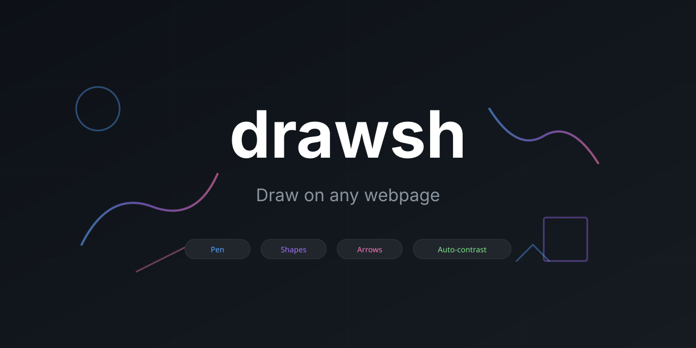

# Drawsh

Draw on any webpage to explain things. Annotate, highlight, sketch ideas.

**Browser:** Chrome, Edge, Brave (Chromium-based)

## Install

1. Clone or download this repo
2. Go to `chrome://extensions`
3. Enable "Developer mode"
4. Click "Load unpacked" and select the `drawsh` folder

## Usage

Click the extension icon or use the keyboard shortcut to toggle drawing mode.

## Tools

| Key | Tool |
|-----|------|
| `P` | Pen (freehand drawing) |
| `L` | Line |
| `A` | Arrow |
| `R` | Rectangle |
| `C` | Circle |
| `T` | Text |
| `E` | Eraser |

## Features

**Auto-contrast strokes** — Default mode draws with black outline + white fill, visible on any background.

**Natural pen strokes** — Pressure and velocity-sensitive drawing with tapered ends.

**Shift modifiers:**
- Lines/arrows: Snap to 15° angles
- Shapes: Constrain to 1:1 aspect ratio (perfect square/circle)

**Other shortcuts:**
| Key | Action |
|-----|--------|
| `1-9` | Select color |
| `Ctrl+Z` | Undo |
| `Ctrl+Shift+Z` | Redo |
| `S` | Copy to clipboard |
| `Esc` | Close drawing mode |

## Colors

1. Auto (black+white outline)
2. Black
3. White
4. Red
5. Blue
6. Green
7. Yellow (transparent)
8. Orange
9. Purple
